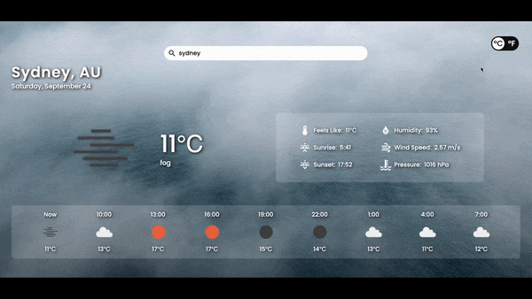

# Weather App

<a href="https://luaroxy.github.io/odin-weatherapp/">Live Demo </a>

# About the Project

Weather app created using vanilla JavaScript and APIs. You can search cities worldwide and get current and forecast weather features.

## Features

- Search cities worldwide.
- Display current temperature of the searched city.
- Display sunrise and sunset of the searched location in its local time.
- Display current feel likes temperatures, humidity, wind speed, and pressure of the searched city.
- Switch between imperial and metric systems.
- Provide 24 hours forecast displayed in each 3 hours.
- Different weather symbols and background videos for each weather condition.
- Display error message if searched city could not be found.

# Technologies Used

  

# Resources Used

API: <a href="https://openweathermap.org/api">Open Weather</a>
\
Background Videos: <a href="https://www.pexels.com/video/the-rays-of-sun-in-a-clear-sky-2605326/">Naim Benjelloun</a>, <a href="https://www.pexels.com/video/thunder-and-flash-of-lightning-5908584/">Nathan Baldwin</a>, <a href="https://www.pexels.com/video/slow-motion-video-of-raindrops-8549483/">Taryn Elliott</a>, <a href="https://www.pexels.com/video/a-mist-over-water-2534297/">Aaron Burden</a>, <a href="https://www.pexels.com/video/the-waning-gibbous-phase-of-the-moon-5626143/">Arpan Bhatia</a>, <a href="https://www.pexels.com/video/footage-of-a-clouds-5019622/">CESAR A RAMIREZ V TRAPHITHO</a> and <a href="https://www.pexels.com/video/a-heavy-snowfall-with-road-sign-on-the-post-6782003/">Gylfi Gylfason</a> on <a href="https://www.pexels.com/">Pexels</a>
\
Font: <a href="https://fonts.google.com/">Google Fonts</a>
\
Icons: <a href="https://materialdesignicons.com/">Material Design Icons</a> and <a href="https://openweathermap.org/weather-conditions">Open Weather</a>
